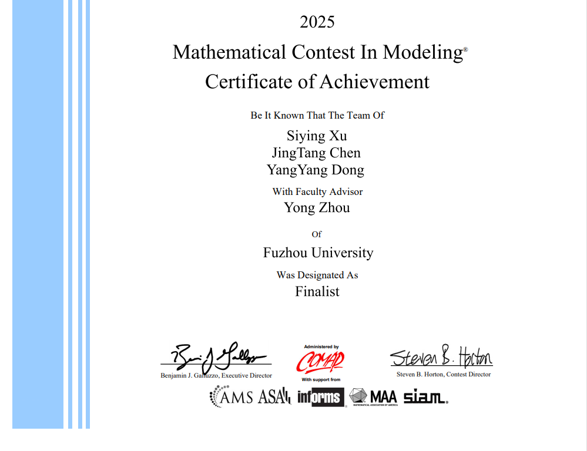

# COMAP MCM/ICM 2025

我们的赛题：2025 MCM  Problem C: Models for Olympic Medal Tables 

本材料为开源免费材料

如果这些材料帮到了你，请不要吝惜，给这个Github仓库一个Star吧🥳这是对我最好的支持方式，感谢！

## 本仓库包括

- [x] PDF: 我们的美赛论文
- [x] Code: 模型的代码（Matlab, Python）
- [x] Figure: 图片制作的PPT模版
- [x] Note: 我的美赛笔记（写作绘图、团队协作）
- [ ] Word: 美赛论文的原始模版

## 团队成员

- [JingtangChen 陈竟镗](https://grokcv.ai/author/jingtang-chen/)  (Leader, Writing，Modeling，coding)
- SiyingXu 徐思颖 ( Writing)
- yangyangDong 董洋杨 (Modeling)
- Advisor:  Mingjian Fu [傅明建教授](https://csip.fzu.edu.cn/?page_id=787), Yong Zhou [周勇教授](https://math.fzu.edu.cn/info/1093/7292.htm)

## 相关资源

- [国际数学建模 F 奖 C题读题与数据分析经验](https://www.xiaohongshu.com/explore/6889888600000000050080b8?xsec_token=ABFNalEj-TsAsNy8LbGbOlsFuCcMoClgm3o6No0f3e3N4=&xsec_source=pc_user)

- [美赛第二期：如何分析AI的结果，拿到 F 奖](https://www.xiaohongshu.com/explore/6899be4200000000050048c2?xsec_token=ABQJOlWqruiNhtpSV6QQDtzaMkWQTRIulGYwB2VBIloiM=&xsec_source=pc_search&source=unknown)

- [美赛第三期：借助 AI 包装创新点，拿下F奖🥳](https://www.xiaohongshu.com/explore/68a5612a000000001d02deab?xsec_token=AB3bvRB-UjJFXoTbhkCWYPxY6OtZG45FgkL_cq1aL3Nnc=&xsec_source=pc_search&source=unknown)

- 百度网盘，实时更新最新美赛开源材料（全部免费！）
  - 链接: https://pan.baidu.com/s/1W3sFX9Io9b7ZWYYlsNbD2w?pwd=1234 
  
  - 提取码: 1234
  
    

## 材料声明

COMAP-MCM-2025美赛材料由本团队汇总整理。材料完全免费开源，支持任意方式转载，请勿商用。

如果你通过转售本材料获利，全部归你，但需要注意的是：销售行为与本团队无关；如果你通过付费手段获得本材料，说明材料并非第一手转载，如果你注意到本声明，请勿再次二次售卖本材料，感谢理解支持！

倡导知识付费，是因为知识创建整理的过程复杂，需要付诸许多心血，而人的精力实在有限，知识付费让这一切关系变得健康；相反地，倡导知识开源，恰恰也正是因为知识宝贵，所以需要让更多人受益，从而充分发挥人的劳动价值，这是在计划里的捐献。

最后的最后，祝你比赛顺利，学业有成。我们高处见！

**致谢**：感谢 [蔡汉霖学长 （Hanlin Cai,剑桥Phd 在读学生）](https://github.com/GuangLun2000),罗文轩学长（Wenxuan Luo，中科院在读学生），为我们提供的宝贵建议，以及提供的宝贵参考资料，让我们有机会从容地站上这个舞台。

### 

 

## 支持我们的工作

如果这些汇总/笔记帮到你，还请Star这个仓库（右上角）🌟

或者，请我喝杯咖啡吧🥰 (18元为宜，1元也是情)

你的支持是我们不断更新的动力！

|  |  |
| ----------------------------------- | ------------------------------------------------------------ |

## Star History

